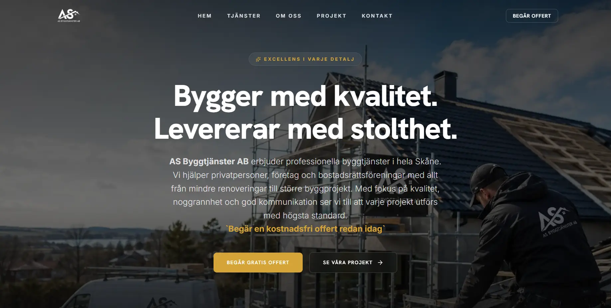

# 🚀 AS Byggtjänster AB - Premium Construction & Totalentreprenad Platform

## **AS Byggtjänster AB** is a modern, high-performance, and fully responsive web platform engineered for a top-tier Swedish construction and general contracting company operating in Skåne / Helsingborg. Built with Scandinavian design aesthetics, high-speed asset optimization, and conversion-focused UX, it showcases luxury kitchen renovations, bathroom transformations, and complete construction services with a seamless client inquiry experience.

## 🌐 Live Site

🔗 https://www.asbyggtjanster.se/

---

## 📌 Features

- **Scandinavian Luxury UI/UX:** Clean, elegant dark-mode & gold accent aesthetic tailored for high-end construction clientele.
- **Performance Optimized:** Built with WebP formats, LCP asset preloading, and self-hosted fonts for maximum PageSpeed scores.
- **Interactive Services & Portfolio:** Multi-section presentation highlighting past projects, credentials, and construction specialties.
- **Conversion-Focused Offert Flow:** Instant quote request system with optimized call-to-action routing for high intent leads.
- **Google Consent Mode v2 & GTM Integration:** Advanced tracking setup compliant with EU privacy regulations to monitor client conversions.
- **SEO & Social Share Ready:** Fully equipped with rich OpenGraph meta tags, Twitter cards, canonical URLs, and auto-generated XML sitemaps.

---

## 📸 Screenshots



---

## 🛠️ Technologies Used

- **React.js + TypeScript** - For a component-based, type-safe architecture
- **Vite** - Lightning-fast build tool and frontend development server
- **Tailwind CSS** - Modern utility-first styling with custom theme configurations
- **Motion (Framer Motion)** - Fluid scroll animations and interactive state transitions
- **Fontsource** - Self-hosted Inter & Hanken Grotesk typography for speed and privacy
- **Lucide React** - Clean vector icons representing construction categories
- **Google Tag Manager** - GDPR-compliant analytics tracking setup
- **Vercel** - Cloud hosting platform with fast global CDN delivery

---

## 📂 Project Structure

````txt
as-byggtjänster/
├─ public/                 # Static assets & SEO configuration files
│  ├─ images/              # High-res WebP project media & hero graphics
│  ├─ favicon.png          # App favicon
│  ├─ logo.png             # Brand identity logo
│  ├─ og-image.jpg         # Social media share image
│  ├─ robots.txt           # Crawler index rules
│  └─ sitemap.xml          # Search engine sitemap
│
├─ src/
│  ├─ components/          # Reusable UI components (Button, Container, Typography...)
│  ├─ data/                # Centralized text, company info, and dynamic data
│  ├─ layout/              # Structural wrappers (Navbar, Footer)
│  ├─ pages/               # Main view pages
│  ├─ sections/            # Page sections (Hero, Services, Projects, Testimonials...)
│  ├─ types/               # TypeScript interfaces and type declarations
│  ├─ App.tsx              # Root App Component
│  ├─ index.css            # Tailwind CSS imports & theme directives
│  └─ main.tsx             # Application DOM entrypoint
│
├─ .env                    # Environment variables
├─ .env.example            # Environment variables template skeleton
├─ index.html              # HTML entry with preloads and Tag Manager scripts
├─ metadata.json           # Site metadata configuration
├─ package.json            # Scripts, dependencies, and build specs
├─ README.md               # Repository documentation
├─ tsconfig.json           # TypeScript configuration
├─ vercel.json             # Vercel deployment configuration
└─ vite.config.ts          # Vite bundler configuration

---

## 💻 Running Locally

1. Clone the repository:
```bash

git clone https://github.com/aliasaad01/AS-Byggtj-nster-AB.git
cd AS-Byggtj-nster-AB

npm install
npm run dev

---
````

## 👨‍💻 Author

**Ali Asaad**

Front-End Developer | React.js + TypeScript

- GitHub: [https://github.com/aliasaad01](https://github.com/aliasaad01)

- ⭐ If you like this project, give it a star on GitHub!
